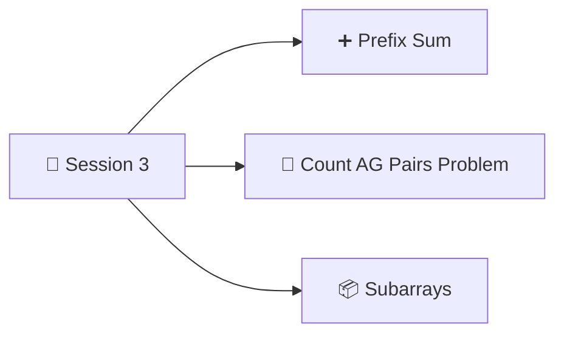

<p align="center"><a href="Session-2.md">⬅️ Session 2</a> &nbsp;|&nbsp; 🏠 <a href="README.md">Home</a></p>

<div align="center">

# 📘 Session 3: Arrays — Prefix Sum and 


</div>

---

## 📑 Table of Contents

1. [📅 Agenda](#-agenda)
2. [❓ Problem: Range Sum Queries](#-problem-range-sum-queries)
   - [How Queries Are Given: `Q[][]`](#-how-queries-are-given-q)
   - [Brute Force](#-brute-force)
3. [🏏 Quiz: Cricket Scores (The Idea Behind Prefix Sum)](#-quiz-cricket-scores-the-idea-behind-prefix-sum)
4. [➕ Prefix Sum Concept](#-prefix-sum-concept)
   - [Observation: Build It in One Pass](#-observation-build-it-in-one-pass)
   - [Code: getPrefixSum](#-code-getprefixsum)
5. [⚡ Using Prefix Sum to Answer Queries](#-using-prefix-sum-to-answer-queries)
   - [The Formula](#-the-formula)
   - [Edge Case: l = 0](#️-edge-case-l--0)
   - [Optimized Code: querySum](#-optimized-code-querysum)
6. [📝 Quiz: Sum of Even-Indexed Elements](#-quiz-sum-of-even-indexed-elements)
7. [📝 Session 3 Revision Summary](#-session-3-revision-summary)
8. [📸 Session 3: Notebook Pages](#-session-3-notebook-pages)

---

## 📅 Agenda



> [!NOTE]
> These notes cover **Prefix Sum**. *Count AG Pairs* and *Subarrays* will be added when those pages are ready.

---

## ❓ Problem: Range Sum Queries

> **Q:** Given an array `A[n]` and **Q queries**.
> For each query, calculate the **sum from `l` to `r`** *(inclusive)*.

#### Example

```
Index:   0    1    2    3    4    5    6    7    8    9
       ┌────┬────┬────┬────┬────┬────┬────┬────┬────┬────┐
  A =  │ -3 │ 6  │ 2  │ 4  │ 5  │ 2  │ 8  │ -9 │ 3  │ 1  │
       └────┴────┴────┴────┴────┴────┴────┴────┴────┴────┘
```

| l | r | Elements added | Sum |
|:---:|:---:|:---|:---:|
| 4 | 8 | 5 + 2 + 8 + (-9) + 3 | **9** |
| 3 | 7 | 4 + 5 + 2 + 8 + (-9) | **10** |
| 1 | 3 | 6 + 2 + 4 | **12** |
| 0 | 4 | -3 + 6 + 2 + 4 + 5 | **14** |
| 7 | 7 | -9 | **-9** |

### 🗂️ How Queries Are Given: `Q[][]`

Queries come as a **2-D array**. Each row is one query `[l, r]`.

```
Q[5][2] = [ [4, 8],
            [3, 7],
            [1, 3],
            [0, 4],
            [7, 7] ]
```

| | Value |
|:---|:---|
| **rows** = `Q.length` | 5 (number of queries) |
| **cols** = `Q[0].length` | 2 (`l` and `r`) |
| Left index | `l = Q[i][0]` |
| Right index | `r = Q[i][1]` |

### 🐢 Brute Force

For every query, loop from `l` to `r` and add.

#### Pseudocode

```c
function querySum(A[], Q[][]) {
    q = Q.length;
    for (i = 0; i <= q-1; i++) {        // q iterations
        l = Q[i][0];                    // left index
        r = Q[i][1];                    // right index
        sum = 0;
        for (j = l; j <= r; j++) {      // up to n iterations
            sum += A[j];
        }
        print(sum);
    }
}
```

#### Python version

```python
def query_sum_brute(A, Q):
    for l, r in Q:
        total = 0
        for j in range(l, r + 1):
            total += A[j]
        print(total)
```

| Time Complexity | Space Complexity |
|:---:|:---:|
| **O(Q × n)** (Q queries, each up to n iterations) | **O(1)** |

> [!WARNING]
> If `n = 10⁵` and `Q = 10⁵`, that's `10¹⁰` iterations, which is more than 10⁸ → **TLE** ❌ (remember the constraints rule from Session 2).
> We need something faster ➜ **Prefix Sum**.

---

## 🏏 Quiz: Cricket Scores (The Idea Behind Prefix Sum)

> [!TIP]
> **Instructor's real-world example 🏏**
>
> `scores[]` of a **10-over match** stores the **total score at the end of each over**:
>
> | Over | 1st | 2nd | 3rd | 4th | 5th | 6th | 7th | 8th | 9th | 10th |
> |:---|:---:|:---:|:---:|:---:|:---:|:---:|:---:|:---:|:---:|:---:|
> | **Score** | 2 | 8 | 14 | 29 | 31 | 49 | 65 | 79 | 88 | 97 |
>
> | Question | Working | Answer |
> |:---|:---|:---:|
> | Runs scored **in the 7th over** | 65 − 49 (score after 6th) | **16** |
> | Runs scored **from 6th to 10th over** (both included) | 97 (after 10th) − 31 (after 5th) | **66** |
> | Runs scored **from 3rd to 6th over** (both included) | 49 (after 6th) − 8 (after 2nd) | **41** |
>
> 💡 We never add over by over. We just **subtract two running totals**.
> A **scoreboard is a prefix sum array!**

---

## ➕ Prefix Sum Concept

> **`prefix[n]`**, where `n = A.length`
>
> **`prefix[i]`** = sum of **all the elements from the 0th index to the ith index**

#### Example

```
Index:       0     1     2     3     4
           ┌─────┬─────┬─────┬─────┬─────┐
    A    = │  2  │  5  │ -1  │  7  │  1  │
           └─────┴─────┴─────┴─────┴─────┘
           ┌─────┬─────┬─────┬─────┬─────┐
  prefix = │  2  │  7  │  6  │ 13  │ 14  │
           └─────┴─────┴─────┴─────┴─────┘
```

| i | prefix[i] | Working |
|:---:|:---:|:---|
| 0 | **2** | 2 |
| 1 | **7** | 2 + 5 |
| 2 | **6** | 2 + 5 − 1 |
| 3 | **13** | 2 + 5 − 1 + 7 |
| 4 | **14** | 2 + 5 − 1 + 7 + 1 |

### 🔍 Observation: Build It in One Pass

```
pf[0] = A[0]
pf[1] = A[0] + A[1]                  = pf[0] + A[1]
pf[2] = A[0] + A[1] + A[2]           = pf[1] + A[2]
pf[3] = A[0] + A[1] + A[2] + A[3]    = pf[2] + A[3]
          └──────── pf[2] ────────┘
...
pf[i] = A[0] + A[1] + ... + A[i-1] + A[i]
          └────── pf[i-1] ──────┘
```

> [!IMPORTANT]
> $$pf[i] = pf[i-1] + A[i]$$
>
> ⚠️ This **won't work for `i = 0`** (`pf[-1]` doesn't exist), so set **`pf[0] = A[0]`** separately.

### 💻 Code: getPrefixSum

#### Pseudocode

```c
int[] getPrefixSum(A[]) {
    int pf[n];                  // new array declaration
    pf[0] = A[0];
    for (i = 1; i <= n-1; i++) {
        pf[i] = pf[i-1] + A[i];
    }
    return pf;
}
```

#### Python version

```python
def get_prefix_sum(A):
    n = len(A)
    pf = [0] * n
    pf[0] = A[0]
    for i in range(1, n):
        pf[i] = pf[i - 1] + A[i]
    return pf

print(get_prefix_sum([2, 5, -1, 7, 1]))   # [2, 7, 6, 13, 14]
```

| Time Complexity | Space Complexity |
|:---:|:---:|
| **O(n)** | **O(n)** (new `pf` array) |

---

## ⚡ Using Prefix Sum to Answer Queries

> **Q:** Can we use the prefix sum to answer the query sums? ✅ **Yes!**

Same example as before:

```
Index:   0    1    2    3    4    5    6    7    8    9
  A  =  -3    6    2    4    5    2    8   -9    3    1
  pf =  -3    3    5    9   14   16   24   15   18   19
```

| l | r | Using pf | Answer |
|:---:|:---:|:---|:---:|
| 4 | 8 | pf[8] − pf[3] = 18 − 9 | **9** ✅ |
| 3 | 7 | pf[7] − pf[2] = 15 − 5 | **10** ✅ |
| 1 | 3 | pf[3] − pf[0] = 9 − (−3) | **12** ✅ |
| 0 | 4 | *left deliberately — edge case, see below* | **14** |
| 7 | 7 | pf[7] − pf[6] = 15 − 24 | **−9** ✅ |

### 📐 The Formula

Take `l = 4, r = 8`: sum = A[4] + A[5] + A[6] + A[7] + A[8]

```
pf[8] = A[0] + A[1] + A[2] + A[3] + A[4] + A[5] + A[6] + A[7] + A[8]
pf[3] = A[0] + A[1] + A[2] + A[3]
        ─────────────────────────────────────────────────────────────
pf[8] − pf[3] =                     A[4] + A[5] + A[6] + A[7] + A[8]  ✅
```

From the above examples:

> [!IMPORTANT]
> $$sum[l, r] = pf[r] - pf[l-1]$$

### ⚠️ Edge Case: l = 0

If `l = 0`: Ans = `pf[r] − pf[-1]` ❌ **index out of bound**

So when `l = 0`, the answer is simply:

> **`sum[0, r] = pf[r]`**

Check: `l = 0, r = 4` → `pf[4]` = **14** ✅

### 🚀 Optimized Code: querySum

#### Pseudocode

```c
function querySum(A[], Q[][]) {
    pf[] = getPrefixSum(A);          // O(n)
    q = Q.length;
    for (i = 0; i <= q-1; i++) {     // O(Q)
        l = Q[i][0];
        r = Q[i][1];
        if (l == 0) {
            sum = pf[r];
        } else {
            sum = pf[r] - pf[l-1];
        }
        print(sum);
    }
}
```

#### Python version

```python
def query_sum(A, Q):
    pf = get_prefix_sum(A)            # O(n)
    for l, r in Q:                    # O(Q)
        if l == 0:
            total = pf[r]
        else:
            total = pf[r] - pf[l - 1]
        print(total)

A = [-3, 6, 2, 4, 5, 2, 8, -9, 3, 1]
Q = [[4, 8], [3, 7], [1, 3], [0, 4], [7, 7]]
query_sum(A, Q)    # 9, 10, 12, 14, -9
```

| | Time Complexity | Space Complexity |
|:---|:---:|:---:|
| 🐢 Brute force | O(Q × n) | O(1) |
| ⚡ **Prefix sum** | **O(n + Q)** | **O(n)** |

> [!TIP]
> Each query is now **O(1)** (one subtraction) instead of O(n).
> For `n = Q = 10⁵`: brute force ≈ 10¹⁰ (TLE ❌), prefix sum ≈ 2 × 10⁵ (✅).

---

## 📝 Quiz: Sum of Even-Indexed Elements

> **Q:** Given `A[n]` and Q queries.
> For every query, return the **sum of all even-indexed elements from `l` to `r`**.

```
Index:   0    1    2    3    4    5
       ┌────┬────┬────┬────┬────┬────┐
  A =  │ 2  │ 3  │ 1  │ 6  │ 4  │ 5  │
       └────┴────┴────┴────┴────┴────┘
```

| l | r | Even indexes in range | Sum |
|:---:|:---:|:---|:---:|
| 1 | 3 | 2 → A[2] = 1 | **1** |
| 2 | 5 | 2, 4 → A[2] + A[4] = 1 + 4 | **5** |
| 0 | 4 | 0, 2, 4 → A[0] + A[2] + A[4] = 2 + 1 + 4 | **7** |
| 3 | 3 | none | **0** |

<details>
<summary><b>💡 Click for solution (added for revision)</b></summary>

<br>

**Idea:** build a prefix sum that **only adds even-indexed elements**; odd indexes add 0.

$$pfEven[i] = pfEven[i-1] + \begin{cases} A[i] & \text{if } i \text{ is even} \\ 0 & \text{if } i \text{ is odd} \end{cases}$$

```
Index:     0    1    2    3    4    5
  A      = 2    3    1    6    4    5
  pfEven = 2    2    3    3    7    7
```

Then use the **same formula**: `pfEven[r] − pfEven[l-1]` (or `pfEven[r]` if `l = 0`).

```python
def even_prefix_sum(A):
    pf = [0] * len(A)
    pf[0] = A[0]                      # index 0 is even
    for i in range(1, len(A)):
        pf[i] = pf[i - 1] + (A[i] if i % 2 == 0 else 0)
    return pf

def even_query_sum(A, Q):
    pf = even_prefix_sum(A)
    return [pf[r] if l == 0 else pf[r] - pf[l - 1] for l, r in Q]

print(even_query_sum([2, 3, 1, 6, 4, 5], [[1, 3], [2, 5], [0, 4], [3, 3]]))
# [1, 5, 7, 0]
```

| Time Complexity | Space Complexity |
|:---:|:---:|
| O(n + Q) | O(n) |

</details>

---

## 📝 Session 3 Revision Summary

| Topic | Key point | TC | SC |
|:---|:---|:---:|:---:|
| Range sum (brute force) | Loop `l → r` for every query | O(Q × n) | O(1) |
| Prefix sum meaning | `pf[i]` = sum of `A[0..i]` (like a cricket scoreboard 🏏) | | |
| Build prefix sum | `pf[0] = A[0]`, `pf[i] = pf[i-1] + A[i]` | O(n) | O(n) |
| Range sum with pf | `pf[r] − pf[l-1]` | O(1) per query | |
| Edge case | `l = 0` → answer is `pf[r]` | | |
| All queries | Build pf once, answer each query in O(1) | **O(n + Q)** | **O(n)** |
| Even-index sum | Prefix sum that adds only even indexes | O(n + Q) | O(n) |

---

## 📸 Session 3: Notebook Pages

<details>
<summary><b>Click to view my handwritten notes</b></summary>

<br>

**Page 15: Agenda, range sum problem, brute force**


**Page 16: Cricket scores quiz, prefix sum concept, observation**


**Page 17: getPrefixSum code, queries using prefix sum, l = 0 edge case**


**Page 18: Optimized querySum and even-indexed quiz**


</details>

---

<p align="center"><a href="Session-2.md">⬅️ Session 2</a> &nbsp;|&nbsp; 🏠 <a href="README.md">Home</a></p>

---

<div align="center">

⭐ *Made with consistency, one class at a time.* ⭐

</div>
