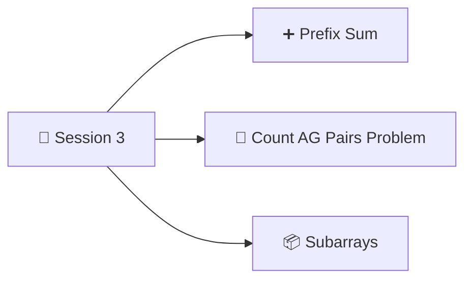

<p align="center"><a href="Session-2.md">⬅️ Session 2</a> &nbsp;|&nbsp; 🏠 <a href="README.md">Home</a></p>

<div align="center">

# 📘 Session 3: Arrays — Prefix Sum and Carry Forward


</div>

---

## 📑 Table 

1. [📅 Agenda](#-agenda)
2. [❓ Problem: Range Sum Queries](#-problem-range-sum-queries)
   - [How Queries Are Given: `Q[][]`](#-how-queries-are-given-q)
   - [Brute Force](#-brute-force)
3. [🏏 Quiz: Cricket Scores (The Idea Behind Prefix Sum)](#-quiz-cricket-scores-the-idea-behind-prefix-sum)
4. [➕ Prefix Sum Concept](#-prefix-sum-concept)
   - [Observation: Build It in One Pass](#-observation-build-it-in-one-pass)
   - [Code: getPrefixSum](#-code-getprefixsum)
5. [⚡ Using Prefix Sum to Answer Queries](#-using-prefix-sum-to-answer-queries)
   - [The Formula](#-the-formula)
   - [Edge Case: l = 0](#️-edge-case-l--0)
   - [Optimized Code: querySum](#-optimized-code-querysum)
6. [📝 Quiz: Sum of Even-Indexed Elements](#-quiz-sum-of-even-indexed-elements)
7. [📝 Quiz: Sum of Even Elements (Not Indices)](#-quiz-sum-of-even-elements-not-indices)
8. [🔙 Prefix Sum → Original Array](#-prefix-sum--original-array)
9. [⭐ Count Special Indices (Amazon)](#-count-special-indices-amazon)
   - [Observation: What Happens When We Remove an Index](#-observation-what-happens-when-we-remove-an-index)
   - [Dry Run](#-dry-run)
   - [Formulas + Edge Case i = 0](#-formulas--edge-case-i--0)
   - [Code: countSpecialIndices](#-code-countspecialindices)
10. [🔁 Carry Forward: Count AG Pairs](#-carry-forward-count-ag-pairs)
11. [📦 Subarrays](#-subarrays)
    - [Definition](#-definition)
    - [Number of Subarrays](#-number-of-subarrays)
    - [Print All Subarrays](#-print-all-subarrays)
12. [📝 Quiz: Smallest Subarray with Min and Max](#-quiz-smallest-subarray-with-min-and-max)
13. [📝 Session 3 Revision Summary](#-session-3-revision-summary)
14. [📸 Session 3: Notebook Pages](#-session-3-notebook-pages)

---

## 📅 Agenda



> [!NOTE]
> **Prefix Sum** comes first, then two problems that use it (even elements, special indices). After that come **Carry Forward** (Count AG Pairs) and **Subarrays**.

---

## ❓ Problem: Range Sum Queries

> **Q:** Given an array `A[n]` and **Q queries**.
> For each query, calculate the **sum from `l` to `r`** *(inclusive)*.

#### Example

```
Index:   0    1    2    3    4    5    6    7    8    9
       ┌────┬────┬────┬────┬────┬────┬────┬────┬────┬────┐
  A =  │ -3 │ 6  │ 2  │ 4  │ 5  │ 2  │ 8  │ -9 │ 3  │ 1  │
       └────┴────┴────┴────┴────┴────┴────┴────┴────┴────┘
```

| l | r | Elements added | Sum |
|:---:|:---:|:---|:---:|
| 4 | 8 | 5 + 2 + 8 + (-9) + 3 | **9** |
| 3 | 7 | 4 + 5 + 2 + 8 + (-9) | **10** |
| 1 | 3 | 6 + 2 + 4 | **12** |
| 0 | 4 | -3 + 6 + 2 + 4 + 5 | **14** |
| 7 | 7 | -9 | **-9** |

### 🗂️ How Queries Are Given: `Q[][]`

Queries come as a **2-D array**. Each row is one query `[l, r]`.

```
Q[5][2] = [ [4, 8],
            [3, 7],
            [1, 3],
            [0, 4],
            [7, 7] ]
```

| | Value |
|:---|:---|
| **rows** = `Q.length` | 5 (number of queries) |
| **cols** = `Q[0].length` | 2 (`l` and `r`) |
| Left index | `l = Q[i][0]` |
| Right index | `r = Q[i][1]` |

### 🐢 Brute Force

For every query, loop from `l` to `r` and add.

#### Pseudocode

```c
function querySum(A[], Q[][]) {
    q = Q.length;
    for (i = 0; i <= q-1; i++) {        // q iterations
        l = Q[i][0];                    // left index
        r = Q[i][1];                    // right index
        sum = 0;
        for (j = l; j <= r; j++) {      // up to n iterations
            sum += A[j];
        }
        print(sum);
    }
}
```

#### Python version

```python
def query_sum_brute(A, Q):
    for l, r in Q:
        total = 0
        for j in range(l, r + 1):
            total += A[j]
        print(total)
```

| Time Complexity | Space Complexity |
|:---:|:---:|
| **O(Q × n)** (Q queries, each up to n iterations) | **O(1)** |

> [!WARNING]
> If `n = 10⁵` and `Q = 10⁵`, that's `10¹⁰` iterations, which is more than 10⁸ → **TLE** ❌ (remember the constraints rule from Session 2).
> We need something faster ➜ **Prefix Sum**.

---

## 🏏 Quiz: Cricket Scores (The Idea Behind Prefix Sum)

> [!TIP]
> **Instructor's real-world example 🏏**
>
> `scores[]` of a **10-over match** stores the **total score at the end of each over**:
>
> | Over | 1st | 2nd | 3rd | 4th | 5th | 6th | 7th | 8th | 9th | 10th |
> |:---|:---:|:---:|:---:|:---:|:---:|:---:|:---:|:---:|:---:|:---:|
> | **Score** | 2 | 8 | 14 | 29 | 31 | 49 | 65 | 79 | 88 | 97 |
>
> | Question | Working | Answer |
> |:---|:---|:---:|
> | Runs scored **in the 7th over** | 65 − 49 (score after 6th) | **16** |
> | Runs scored **from 6th to 10th over** (both included) | 97 (after 10th) − 31 (after 5th) | **66** |
> | Runs scored **from 3rd to 6th over** (both included) | 49 (after 6th) − 8 (after 2nd) | **41** |
>
> 💡 We never add over by over. We just **subtract two running totals**.
> A **scoreboard is a prefix sum array!**

---

## ➕ Prefix Sum Concept

> **`prefix[n]`**, where `n = A.length`
>
> **`prefix[i]`** = sum of **all the elements from the 0th index to the ith index**

#### Example

```
Index:       0     1     2     3     4
           ┌─────┬─────┬─────┬─────┬─────┐
    A    = │  2  │  5  │ -1  │  7  │  1  │
           └─────┴─────┴─────┴─────┴─────┘
           ┌─────┬─────┬─────┬─────┬─────┐
  prefix = │  2  │  7  │  6  │ 13  │ 14  │
           └─────┴─────┴─────┴─────┴─────┘
```

| i | prefix[i] | Working |
|:---:|:---:|:---|
| 0 | **2** | 2 |
| 1 | **7** | 2 + 5 |
| 2 | **6** | 2 + 5 − 1 |
| 3 | **13** | 2 + 5 − 1 + 7 |
| 4 | **14** | 2 + 5 − 1 + 7 + 1 |

### 🔍 Observation: Build It in One Pass

```
pf[0] = A[0]
pf[1] = A[0] + A[1]                  = pf[0] + A[1]
pf[2] = A[0] + A[1] + A[2]           = pf[1] + A[2]
pf[3] = A[0] + A[1] + A[2] + A[3]    = pf[2] + A[3]
          └──────── pf[2] ────────┘
...
pf[i] = A[0] + A[1] + ... + A[i-1] + A[i]
          └────── pf[i-1] ──────┘
```

> [!IMPORTANT]
> $$pf[i] = pf[i-1] + A[i]$$
>
> ⚠️ This **won't work for `i = 0`** (`pf[-1]` doesn't exist), so set **`pf[0] = A[0]`** separately.

### 💻 Code: getPrefixSum

#### Pseudocode

```c
int[] getPrefixSum(A[]) {
    int pf[n];                  // new array declaration
    pf[0] = A[0];
    for (i = 1; i <= n-1; i++) {
        pf[i] = pf[i-1] + A[i];
    }
    return pf;
}
```

#### Python version

```python
def get_prefix_sum(A):
    n = len(A)
    pf = [0] * n
    pf[0] = A[0]
    for i in range(1, n):
        pf[i] = pf[i - 1] + A[i]
    return pf

print(get_prefix_sum([2, 5, -1, 7, 1]))   # [2, 7, 6, 13, 14]
```

| Time Complexity | Space Complexity |
|:---:|:---:|
| **O(n)** | **O(n)** (new `pf` array) |

---

## ⚡ Using Prefix Sum to Answer Queries

> **Q:** Can we use the prefix sum to answer the query sums? ✅ **Yes!**

Same example as before:

```
Index:   0    1    2    3    4    5    6    7    8    9
  A  =  -3    6    2    4    5    2    8   -9    3    1
  pf =  -3    3    5    9   14   16   24   15   18   19
```

| l | r | Using pf | Answer |
|:---:|:---:|:---|:---:|
| 4 | 8 | pf[8] − pf[3] = 18 − 9 | **9** ✅ |
| 3 | 7 | pf[7] − pf[2] = 15 − 5 | **10** ✅ |
| 1 | 3 | pf[3] − pf[0] = 9 − (−3) | **12** ✅ |
| 0 | 4 | *left deliberately — edge case, see below* | **14** |
| 7 | 7 | pf[7] − pf[6] = 15 − 24 | **−9** ✅ |

### 📐 The Formula

Take `l = 4, r = 8`: sum = A[4] + A[5] + A[6] + A[7] + A[8]

```
pf[8] = A[0] + A[1] + A[2] + A[3] + A[4] + A[5] + A[6] + A[7] + A[8]
pf[3] = A[0] + A[1] + A[2] + A[3]
        ─────────────────────────────────────────────────────────────
pf[8] − pf[3] =                     A[4] + A[5] + A[6] + A[7] + A[8]  ✅
```

From the above examples:

> [!IMPORTANT]
> $$sum[l, r] = pf[r] - pf[l-1]$$

### ⚠️ Edge Case: l = 0

If `l = 0`: Ans = `pf[r] − pf[-1]` ❌ **index out of bound**

So when `l = 0`, the answer is simply:

> **`sum[0, r] = pf[r]`**

Check: `l = 0, r = 4` → `pf[4]` = **14** ✅

### 🚀 Optimized Code: querySum

#### Pseudocode

```c
function querySum(A[], Q[][]) {
    pf[] = getPrefixSum(A);          // O(n)
    q = Q.length;
    for (i = 0; i <= q-1; i++) {     // O(Q)
        l = Q[i][0];
        r = Q[i][1];
        if (l == 0) {
            sum = pf[r];
        } else {
            sum = pf[r] - pf[l-1];
        }
        print(sum);
    }
}
```

#### Python version

```python
def query_sum(A, Q):
    pf = get_prefix_sum(A)            # O(n)
    for l, r in Q:                    # O(Q)
        if l == 0:
            total = pf[r]
        else:
            total = pf[r] - pf[l - 1]
        print(total)

A = [-3, 6, 2, 4, 5, 2, 8, -9, 3, 1]
Q = [[4, 8], [3, 7], [1, 3], [0, 4], [7, 7]]
query_sum(A, Q)    # 9, 10, 12, 14, -9
```

| | Time Complexity | Space Complexity |
|:---|:---:|:---:|
| 🐢 Brute force | O(Q × n) | O(1) |
| ⚡ **Prefix sum** | **O(n + Q)** | **O(n)** |

> [!TIP]
> Each query is now **O(1)** (one subtraction) instead of O(n).
> For `n = Q = 10⁵`: brute force ≈ 10¹⁰ (TLE ❌), prefix sum ≈ 2 × 10⁵ (✅).

---

## 📝 Quiz: Sum of Even-Indexed Elements

> **Q:** Given `A[n]` and Q queries.
> For every query, return the **sum of all even-indexed elements from `l` to `r`**.

```
Index:   0    1    2    3    4    5
       ┌────┬────┬────┬────┬────┬────┐
  A =  │ 2  │ 3  │ 1  │ 6  │ 4  │ 5  │
       └────┴────┴────┴────┴────┴────┘
```

| l | r | Even indexes in range | Sum |
|:---:|:---:|:---|:---:|
| 1 | 3 | 2 → A[2] = 1 | **1** |
| 2 | 5 | 2, 4 → A[2] + A[4] = 1 + 4 | **5** |
| 0 | 4 | 0, 2, 4 → A[0] + A[2] + A[4] = 2 + 1 + 4 | **7** |
| 3 | 3 | none | **0** |

<details>
<summary><b>💡 Click for solution (added for revision)</b></summary>

<br>

**Idea:** build a prefix sum that **only adds even-indexed elements**; odd indexes add 0.

$$pfEven[i] = pfEven[i-1] + \begin{cases} A[i] & \text{if } i \text{ is even} \\ 0 & \text{if } i \text{ is odd} \end{cases}$$

```
Index:     0    1    2    3    4    5
  A      = 2    3    1    6    4    5
  pfEven = 2    2    3    3    7    7
```

Then use the **same formula**: `pfEven[r] − pfEven[l-1]` (or `pfEven[r]` if `l = 0`).

```python
def even_prefix_sum(A):
    pf = [0] * len(A)
    pf[0] = A[0]                      # index 0 is even
    for i in range(1, len(A)):
        pf[i] = pf[i - 1] + (A[i] if i % 2 == 0 else 0)
    return pf

def even_query_sum(A, Q):
    pf = even_prefix_sum(A)
    return [pf[r] if l == 0 else pf[r] - pf[l - 1] for l, r in Q]

print(even_query_sum([2, 3, 1, 6, 4, 5], [[1, 3], [2, 5], [0, 4], [3, 3]]))
# [1, 5, 7, 0]
```

| Time Complexity | Space Complexity |
|:---:|:---:|
| O(n + Q) | O(n) |

</details>

---

## 📝 Quiz: Sum of Even Elements (Not Indices)

> **Q:** Given an array and Q queries (`l` and `r`).
> For each query, return the **sum of all even elements** from `l` to `r`.
> ⚠️ Even **elements** (the value is even), **not** even indices. That's the difference from the quiz above.

```
Index:   0    1    2    3    4    5
       ┌────┬────┬────┬────┬────┬────┐
  A =  │ 2  │ 3  │ 1  │ 6  │ 4  │ 5  │
       └────┴────┴────┴────┴────┴────┘
```

| l | r | Elements in range | Even elements | Sum |
|:---:|:---:|:---|:---|:---:|
| 1 | 3 | 3, 1, 6 | 6 | **6** |
| 2 | 5 | 1, 6, 4, 5 | 6, 4 | **10** |
| 0 | 5 | 2, 3, 1, 6, 4, 5 | 2, 6, 4 | **12** |
| 2 | 2 | 1 | none | **0** |

### 🐢 Brute Force

```c
function querySum(A[], Q[][]) {
    q = Q.length;
    for (i = 0; i <= q-1; i++) {
        l = Q[i][0];
        r = Q[i][1];
        sum = 0;
        for (j = l; j <= r; j++) {
            if (A[j] % 2 == 0) {
                sum += A[j];
            }
        }
        print(sum);
    }
}
```

| Time Complexity | Space Complexity |
|:---:|:---:|
| O(Q × n) | O(1) |

### ⚡ Prefix Sum of Even Elements

**Idea:** the prefix sum only adds a value if it's **even**. Odd values add 0 (just copy `pf[i-1]`).

```
Index:   0    1    2    3    4    5
  A   =  2    3    1    6    4    5
  pf  =  2    2    2    8   12   12
```

#### Pseudocode

```c
int[] getEvenElementsPrefixSum(A[]) {
    pf[n];
    pf[0] = (A[0] % 2 == 0) ? A[0] : 0;
    for (i = 1; i <= n-1; i++) {
        if (A[i] % 2 == 0) {
            pf[i] = pf[i-1] + A[i];
        } else {
            pf[i] = pf[i-1];
        }
    }
    return pf;
}

function querySum(A[], Q[][]) {
    pf[] = getEvenElementsPrefixSum(A);
    q = Q.length;
    for (i = 0; i <= q-1; i++) {
        l = Q[i][0];
        r = Q[i][1];
        if (l == 0) {
            sum = pf[r];
        } else {
            sum = pf[r] - pf[l-1];   // ✅ minus
        }
        print(sum);
    }
}
```

> [!WARNING]
> **Correction:** my notes wrote `sum = pf[l-1] + pf[r]`. It must be **`pf[r] − pf[l-1]`**, the same range-sum formula as before.
> With `+`, query (2, 5) would give 2 + 12 = 14 instead of **10**.

#### Python version

```python
def get_even_elements_prefix_sum(A):
    pf = [0] * len(A)
    pf[0] = A[0] if A[0] % 2 == 0 else 0
    for i in range(1, len(A)):
        pf[i] = pf[i - 1] + (A[i] if A[i] % 2 == 0 else 0)
    return pf

def query_sum_even_elements(A, Q):
    pf = get_even_elements_prefix_sum(A)
    return [pf[r] if l == 0 else pf[r] - pf[l - 1] for l, r in Q]

print(query_sum_even_elements([2, 3, 1, 6, 4, 5], [[1, 3], [2, 5], [0, 5], [2, 2]]))
# [6, 10, 12, 0]
```

| | Time Complexity | Space Complexity |
|:---|:---:|:---:|
| Build pf | O(n) | O(n) |
| All queries | **O(n + Q)** | **O(n)** |

---

## 🔙 Prefix Sum → Original Array

> **Q:** Given a prefix sum array `prefSum = [-2, 4, 1, 5, 2]`.
> What is the **sum of the original array from index 2 to 4** (0-based)?

### How I found the original array

Since `pf[i] = pf[i-1] + A[i]`, we can flip it around:

> [!IMPORTANT]
> $$A[0] = pf[0] \qquad A[i] = pf[i] - pf[i-1]$$

| Index | Working | A[i] |
|:---:|:---|:---:|
| 0 | leave it: pf[0] | **−2** |
| 1 | pf[1] − pf[0] = 4 − (−2) | **6** |
| 2 | pf[2] − pf[1] = 1 − 4 | **−3** |
| 3 | pf[3] − pf[2] = 5 − 1 | **4** |
| 4 | pf[4] − pf[3] = 2 − 5 | **−3** |

**Original array = [−2, 6, −3, 4, −3]** ✅

**Sum from index 2 to 4** = −3 + 4 + (−3) = **−2**

> [!TIP]
> *Added:* we don't even need the original array. Just use the range-sum formula:
> `pf[4] − pf[1] = 2 − 4 = −2` ✅

> [!CAUTION]
> **My first (wrong) attempt:** I tried `A[i] = pf[i] + pf[i-1]` (adding). That's wrong.
> A prefix sum **adds** to build up, so to go back we **subtract**.

---

## ⭐ Count Special Indices (Amazon)

> **Q:** Given an array `A[n]`, count the **special indices**.
>
> An index is **special** if, **after removing it**,
> **sum of all even-indexed elements = sum of all odd-indexed elements**.

### 🔍 Observation: What Happens When We Remove an Index

```
Index:    0    1    2    3    4    5    6    7    8    9
A    =  [ 2 |  3 |  1 |  4 |  0 | -1 |  2 | -2 | 10 |  8 ]
                         ↑ remove index 3

Index:    0    1    2    3    4    5    6    7    8
After = [ 2 |  3 |  1 |  0 | -1 |  2 | -2 | 10 |  8 ]
```

After removing index `i = 3`:
- From **`[0, i-1]`** → **no change** in indices.
- From **`[i+1, n-1]`** → everything shifts left by 1, so **even indices become odd** and **odd indices become even**.

So, after removing index 3:

$$Sum_{odd} = Sum_{odd}[0, 2] + Sum_{even}[4, 9]$$

$$Sum_{even} = Sum_{even}[0, 2] + Sum_{odd}[4, 9]$$

> [!TIP]
> For my own implementation I need **two prefix arrays**:
> - `pfEven`: prefix sum of **even-indexed** elements (odd indexes add 0)
> - `pfOdd`: prefix sum of **odd-indexed** elements (even indexes add 0)

### 🧪 Dry Run

`A = [4, 3, 2, 7, 6, -2]` ➜ special = ?

| Removed i | Updated array | Sum even idx | Sum odd idx | Special? |
|:---:|:---|:---:|:---:|:---:|
| 0 | [3, 2, 7, 6, -2] | 3 + 7 − 2 = **8** | 2 + 6 = **8** | ✅ |
| 1 | [4, 2, 7, 6, -2] | 4 + 7 − 2 = **9** | 2 + 6 = **8** | ❌ |
| 2 | [4, 3, 7, 6, -2] | 4 + 7 − 2 = **9** | 3 + 6 = **9** | ✅ |
| 3 | [4, 3, 2, 6, -2] | 4 + 2 − 2 = **4** | 3 + 6 = **9** | ❌ |
| 4 | [4, 3, 2, 7, -2] | 4 + 2 − 2 = **4** | 3 + 7 = **10** | ❌ |
| 5 | [4, 3, 2, 7, 6] | 4 + 2 + 6 = **12** | 3 + 7 = **10** | ❌ |

**Answer: 2 special indices** (index 0 and index 2)

### 📐 Formulas + Edge Case i = 0

**For odd (sum of odd-indexed elements after removing `i`):**

```
Ans = Sum_odd[0, i-1] + Sum_even[i+1, n-1]
    = pfOdd[i-1]      + pfEven[n-1] − pfEven[i]
```

**For even (sum of even-indexed elements after removing `i`):**

```
Ans = Sum_even[0, i-1] + Sum_odd[i+1, n-1]
    = pfEven[i-1]      + pfOdd[n-1] − pfOdd[i]
```

> [!IMPORTANT]
> **Edge case `i = 0`:** there is no `[0, i-1]` part (`pf[-1]` would be out of bound), so:
> - `Sodd  = pfEven[n-1] − pfEven[0]`
> - `Seven = pfOdd[n-1] − pfOdd[0]`

### 💻 Code: countSpecialIndices

#### Pseudocode

```c
function countSpecialIndices(A) {
    pfOdd  = getOddIndicesPrefixSum(A);
    pfEven = getEvenIndicesPrefixSum(A);
    count = 0;
    for (i = 0; i <= n-1; i++) {
        if (i == 0) {
            Sodd  = pfEven[n-1] - pfEven[i];
            Seven = pfOdd[n-1]  - pfOdd[i];
        } else {
            Sodd  = pfOdd[i-1]  + pfEven[n-1] - pfEven[i];
            Seven = pfEven[i-1] + pfOdd[n-1]  - pfOdd[i];
        }
        if (Seven == Sodd) {
            count++;
        }
    }
    return count;
}
```

> [!NOTE]
> *Completed:* the last `if (Seven == Sodd) count++` and `return count` were cut off on my page, so I added them.

#### Python version

```python
def count_special_indices(A):
    n = len(A)
    pf_even = [0] * n
    pf_odd = [0] * n
    for i in range(n):
        prev_even = pf_even[i - 1] if i > 0 else 0
        prev_odd = pf_odd[i - 1] if i > 0 else 0
        pf_even[i] = prev_even + (A[i] if i % 2 == 0 else 0)
        pf_odd[i] = prev_odd + (A[i] if i % 2 == 1 else 0)

    count = 0
    for i in range(n):
        if i == 0:
            s_odd = pf_even[n - 1] - pf_even[0]
            s_even = pf_odd[n - 1] - pf_odd[0]
        else:
            s_odd = pf_odd[i - 1] + pf_even[n - 1] - pf_even[i]
            s_even = pf_even[i - 1] + pf_odd[n - 1] - pf_odd[i]
        if s_even == s_odd:
            count += 1
    return count

print(count_special_indices([4, 3, 2, 7, 6, -2]))   # 2
```

| | Time Complexity | Space Complexity |
|:---|:---:|:---:|
| 🐢 Brute force (remove each index, re-add everything) | O(n²) | O(n) |
| ⚡ **Two prefix sums** | **O(n)** | **O(n)** |

---

## 🔁 Carry Forward: Count AG Pairs

> **Q:** Given a string, count the pairs `(i, j)` where **`i < j`**, `str[i] = 'a'` and `str[j] = 'g'`.
>
> *(Problem statement written from the examples; the statement page wasn't in this set.)*

#### Example

```
Index:  0   1   2   3   4   5   6   7
        b   c   a   g   g   a   a   g
```

AG pairs: `{2,3}`, `{2,4}`, `{2,7}`, `{5,7}`, `{6,7}` ➜ **5 pairs**

### 🐢 Brute Force

For every `'a'`, look at all positions to its right and count the `'g'`s.

```c
res = 0;
for (i = 0; i <= n-1; i++) {
    if (str[i] == 'a') {
        for (j = i+1; j <= n-1; j++) {
            if (str[j] == 'g') {
                res++;
            }
        }
    }
}
return res;
```

| Time Complexity | Space Complexity |
|:---:|:---:|
| O(n²) | O(1) |

### 💡 Observation

```
Index:  0   1   2   3   4   5   6   7   8
        a   c   b   a   g   k   a   g   g
```

- If I have `'a'` at index 0, every `'g'` on my **right side** makes a pair → 3 g's = **3 AG pairs**.
- Flip it around: **when I meet a `'g'`, the number of AG pairs it makes = number of `'a'` on its left side.**

So we **carry forward** a running count of `'a'`:

| Index | 0 | 1 | 2 | 3 | 4 | 5 | 6 | 7 | 8 |
|:---|:---:|:---:|:---:|:---:|:---:|:---:|:---:|:---:|:---:|
| **char** | a | c | b | a | g | k | a | g | g |
| **count_A** | 1 | 1 | 1 | 2 | 2 | 2 | 3 | 3 | 3 |
| **pairs** (ans) | 0 | 0 | 0 | 0 | **2** | 2 | 2 | **5** | **8** |
| new pairs | | | | | (0,4) (3,4) | | | (0,7) (3,7) (6,7) | (0,8) (3,8) (6,8) |

✅ **Answer = 8**

### ⚡ Optimized Code (Carry Forward)

#### Pseudocode

```c
ans = 0;
count_A = 0;
for (i = 0; i <= n-1; i++) {
    if (str[i] == 'a') {
        count_A++;
    } else if (str[i] == 'g') {
        ans += count_A;
    }
}
return ans;
```

> [!NOTE]
> *Small fix:* my notes had `return res`, but in this version the variable is `ans`.

#### Python version

```python
def count_ag_pairs(s):
    count_a = 0
    ans = 0
    for ch in s:
        if ch == 'a':
            count_a += 1
        elif ch == 'g':
            ans += count_a     # every 'a' seen so far pairs with this 'g'
    return ans

print(count_ag_pairs("acbagkagg"))   # 8
print(count_ag_pairs("bcaggaag"))    # 5
```

| | Time Complexity | Space Complexity |
|:---|:---:|:---:|
| 🐢 Brute force | O(n²) | O(1) |
| ⚡ **Carry forward** | **O(n)** | **O(1)** |

> [!TIP]
> **Carry forward vs prefix sum:** both keep a running total, but carry forward keeps only **one variable** instead of a whole array → **O(1) space**.

---

## 📦 Subarrays

### 📖 Definition

> A **subarray** is a **continuous** and **ordered** part of an array.

```
  A = [ 4 | 1 | 2 | 3 | -1 | 6 | 9 | 8 | 12 ]
```

| Example | Subarray? | Why |
|:---|:---:|:---|
| `2, 3, -1, 6` | ✅ | continuous and in order |
| `9` | ✅ | a single element is a subarray |
| `4, 1, 2, 3, -1, 6, 9, 8, 12` | ✅ | the whole array is a subarray |
| `4, 2, 3, -1` | ❌ | **not continuous** (skipped 1) |
| `3, 2, 1, 4` | ❌ | **not ordered** |

### 🔢 Number of Subarrays

```
Index:   0    1    2    3    4    5    6
  A  = [ 4 |  2 | 10 |  3 | 12 | -2 | 15 ]      n = 7
```

**Subarrays starting from index 0:**

| # | Subarray |
|:---:|:---|
| 1 | [4] |
| 2 | [4, 2] |
| 3 | [4, 2, 10] |
| 4 | [4, 2, 10, 3] |
| 5 | [4, 2, 10, 3, 12] |
| 6 | [4, 2, 10, 3, 12, −2] |
| 7 | [4, 2, 10, 3, 12, −2, 15] |

Ans = **7**. Starting from index 1 ➜ Ans = **6**.

| Subarrays starting from index | Count | = (n − i) |
|:---:|:---:|:---:|
| 0 | 7 | 7 − 0 |
| 1 | 6 | 7 − 1 |
| 2 | 5 | 7 − 2 |
| 3 | 4 | 7 − 3 |
| ... | ... | ... |
| i | **n − i** | |

> [!IMPORTANT]
> *Added (sum of the table):* **Total subarrays** = n + (n−1) + ... + 2 + 1 = $$\frac{n(n+1)}{2}$$
> For n = 7 → 7 × 8 / 2 = **28** subarrays.

### 🖨️ Print All Subarrays

`A = [1, 2, 3]`

| Start | Subarrays |
|:---:|:---|
| 0th | [1], [1, 2], [1, 2, 3] |
| 1st | [2], [2, 3] |
| 2nd | [3] |

#### Pseudocode

```c
for (i = 0; i <= n-1; i++) {           // start
    for (j = i; j <= n-1; j++) {       // end
        for (k = i; k <= j; k++) {     // print from start to end
            print(A[k]);
        }
        new line;
    }
}
```

#### Python version

```python
def print_all_subarrays(A):
    n = len(A)
    for i in range(n):              # start
        for j in range(i, n):       # end
            for k in range(i, j + 1):
                print(A[k], end=" ")
            print()                 # new line

print_all_subarrays([1, 2, 3])
# 1
# 1 2
# 1 2 3
# 2
# 2 3
# 3
```

| Time Complexity | Space Complexity |
|:---:|:---:|
| **O(n³)** | **O(1)** |

---

## 📝 Quiz: Smallest Subarray with Min and Max

> **Q:** Given `A[]`, find the **size of the smallest subarray** that contains **at least one occurrence of both the min and the max** value of `A[]`.

#### Examples

| Array | Min | Max | Smallest subarray | Size |
|:---|:---:|:---:|:---|:---:|
| [1, 3, 2] | 1 | 3 | [1, 3] | **2** |
| [3, 1, 4, 2, 5, 3, 2, 4, 2, 1] | 1 | 5 | [1, 4, 2, 5] (index 1 → 4) | **4** |

### 🐢 Brute Force

Go through **all subarrays**. For each subarray, check if it has max and min. If yes, update ans.

```c
min = getMin(A);     // O(n)
max = getMax(A);     // O(n)
ans = ∞;
for (i = 0; i <= n-1; i++) {
    for (j = i; j <= n-1; j++) {
        for (k = i; k <= j; k++) {
            // check if it has max & min
            // yes → update ans
        }
    }
}
```

| Time Complexity | Space Complexity |
|:---:|:---:|
| O(n³) | O(1) |

### 💡 Approach

> **My min and max should be at the ends only.**
> The smallest answer always **starts at a min and ends at a max** (or the other way). So walk once, remember the **latest index** of min and max, and measure the distance.

#### Dry run: `A = [3, 1, 4, 2, 5, 3, 2, 4, 2, 1]`

`min = 1`, `max = 5`, `min_index = -1`, `max_index = -1`, `ans = ∞`

| i | A[i] | What happens | min_index | max_index | size | ans |
|:---:|:---:|:---|:---:|:---:|:---:|:---:|
| 0 | 3 | no min and no max found | -1 | -1 | | ∞ |
| 1 | 1 | **min found** | 1 | -1 | | ∞ |
| 2 | 4 | no min, no max | 1 | -1 | | ∞ |
| 3 | 2 | no min, no max | 1 | -1 | | ∞ |
| 4 | 5 | **max found** | 1 | 4 | 4 − 1 + 1 = 4 | **4** |
| 5 | 3 | no change | 1 | 4 | | 4 |
| 6 | 2 | no change | 1 | 4 | | 4 |
| 7 | 4 | no change | 1 | 4 | | 4 |
| 8 | 2 | no change | 1 | 4 | | 4 |
| 9 | 1 | **min found again** | 9 | 4 | 9 − 4 + 1 = 6 | 4 (6 is bigger) |

✅ **Answer = 4**

> [!NOTE]
> *Correction:* at i = 9 my notes wrote size `9 − 4 + 1 = 5`, but it's **6**. The answer 4 doesn't change, since 6 is bigger.

### ⚡ Optimized Code

#### Pseudocode

```c
function getSmallestSubArray(A[]) {
    min = +∞;          // Integer.MAX_VALUE
    max = -∞;          // Integer.MIN_VALUE
    for (i = 0; i <= n-1; i++) {
        min = Math.min(min, A[i]);
        max = Math.max(max, A[i]);
    }
    min_index = -1;
    max_index = -1;
    ans = +∞;

    if (min == max) {
        return 1;      // all elements are same (or) one element
    }

    for (i = 0; i <= n-1; i++) {
        if (A[i] == min) {
            min_index = i;
        }
        if (A[i] == max) {
            max_index = i;
        }
        if (min_index != -1 && max_index != -1) {
            size = Math.abs(min_index - max_index) + 1;
            ans = Math.min(ans, size);
        }
    }
    return ans;
}
```

> [!WARNING]
> `ans` must start at **+∞** (a very big number). My code page shows `ans = -∞`. With −∞, `min(ans, size)` would always stay −∞.

#### Python version

```python
def get_smallest_subarray(A):
    mn, mx = min(A), max(A)
    if mn == mx:
        return 1              # all elements same, or only one element

    min_index = max_index = -1
    ans = float('inf')
    for i, x in enumerate(A):
        if x == mn:
            min_index = i
        if x == mx:
            max_index = i
        if min_index != -1 and max_index != -1:
            ans = min(ans, abs(min_index - max_index) + 1)
    return ans

print(get_smallest_subarray([1, 3, 2]))                        # 2
print(get_smallest_subarray([3, 1, 4, 2, 5, 3, 2, 4, 2, 1]))   # 4
```

| | Time Complexity | Space Complexity |
|:---|:---:|:---:|
| 🐢 Brute force | O(n³) | O(1) |
| ⚡ **Track latest min/max index** | **O(n)** | **O(1)** |

---

## 📝 Session 3 Revision Summary

| Topic | Key point | TC | SC |
|:---|:---|:---:|:---:|
| Range sum (brute force) | Loop `l → r` for every query | O(Q × n) | O(1) |
| Prefix sum meaning | `pf[i]` = sum of `A[0..i]` (like a cricket scoreboard 🏏) | | |
| Build prefix sum | `pf[0] = A[0]`, `pf[i] = pf[i-1] + A[i]` | O(n) | O(n) |
| Range sum with pf | `pf[r] − pf[l-1]` | O(1) per query | |
| Edge case | `l = 0` → answer is `pf[r]` | | |
| All queries | Build pf once, answer each query in O(1) | **O(n + Q)** | **O(n)** |
| Even-**index** sum | Prefix sum that adds only even indexes | O(n + Q) | O(n) |
| Even-**element** sum | Prefix sum that adds only even values | O(n + Q) | O(n) |
| Prefix sum → original | `A[0] = pf[0]`, `A[i] = pf[i] − pf[i-1]` (subtract!) | O(n) | |
| Special indices (Amazon) | After removing `i`, right side's even/odd swap; use `pfEven` + `pfOdd` | O(n) | O(n) |
| AG pairs | Carry forward `count_A`; each `'g'` adds `count_A` | O(n) | O(1) |
| Subarray | Continuous + ordered part of an array | | |
| Number of subarrays | Starting at i: `n − i`; total `n(n+1)/2` | | |
| Print all subarrays | 3 loops: start, end, print | O(n³) | O(1) |
| Smallest subarray with min & max | Track latest min/max index, `abs(diff) + 1` | O(n) | O(1) |

---

## 📸 Session 3: Notebook Pages

<details>
<summary><b>Click to view my handwritten notes</b></summary>

<br>

**Page 15: Agenda, range sum problem, brute force**


**Page 16: Cricket scores quiz, prefix sum concept, observation**


**Page 17: getPrefixSum code, queries using prefix sum, l = 0 edge case**


**Page 18: Optimized querySum and even-indexed quiz**


**Page 19: Quiz — sum of even elements, brute force**


**Page 20: Even elements prefix sum and querySum**


**Page 21: Print all subarrays, prefix sum → original array (first attempt)**


**Page 22: Finding the original array, special indices problem (Amazon)**


**Page 23: Special indices — observation**


**Page 24: Special indices — dry run**


**Page 25: Special indices — formulas and code**


**Page 26: AG pairs — example and brute force**


**Page 27: AG pairs — carry forward approach, subarray definition**


**Page 28: Not subarrays, number of subarrays**


**Page 29: Quiz — smallest subarray with min and max, brute force**


**Page 30: Min–max approach dry run**


**Page 31: getSmallestSubArray code**


</details>

---

<p align="center"><a href="Session-2.md">⬅️ Session 2</a> &nbsp;|&nbsp; 🏠 <a href="README.md">Home</a></p>

---

<div align="center">

⭐ *Made with consistency, one class at a time.* ⭐

</div>
