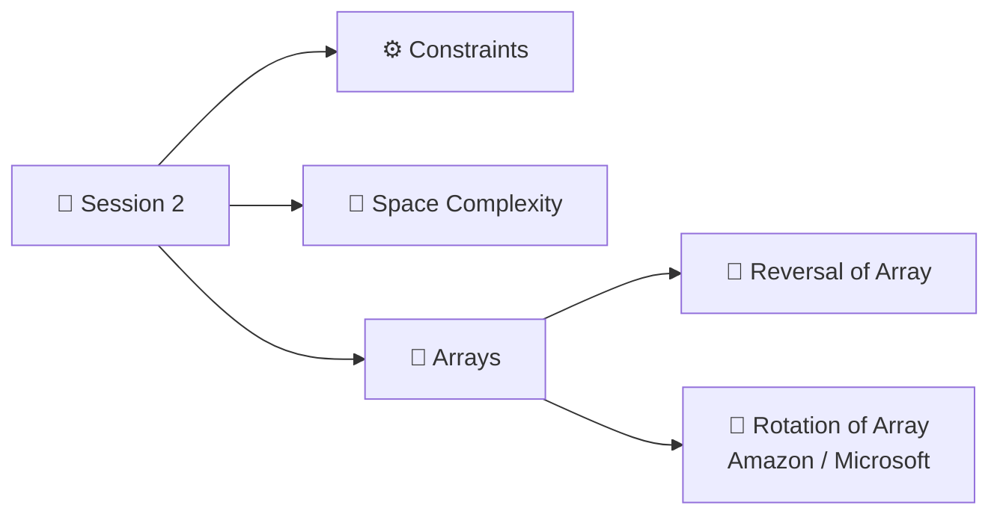
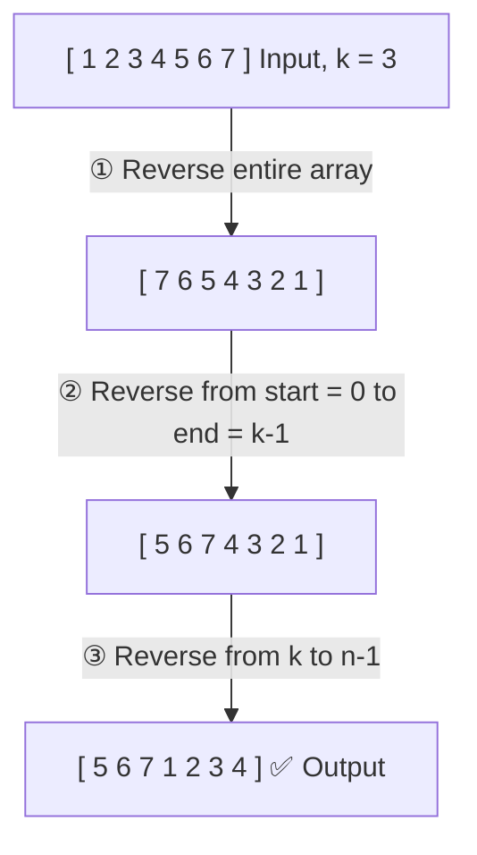

<p align="center"><a href="Session-1.md">⬅️ Session 1</a> &nbsp;|&nbsp; 🏠 <a href="README.md">Home</a></p>

<div align="center">

# 📙 Session 2: Constraints, Space Complexity & Arrays

</div>

<div align="center">


</div>

---

## 📑 Table of Contents

1. [📅 Agenda](#-agenda)
2. [📝 Recap Quiz](#-recap-quiz)
3. [🧠 Math Properties: Logarithms](#-math-properties-logarithms)
4. [⚙️ Importance of Constraints](#️-importance-of-constraints)
5. [💾 Space Complexity](#-space-complexity)
   - [More Examples: Counting Space Units](#-more-examples-counting-space-units)
6. [🧮 Arrays](#-arrays)
   - [What Is an Array?](#-what-is-an-array)
   - [Indexing and Index Out of Bound](#-indexing-and-index-out-of-bound)
   - [Q: Print All Elements](#-q-print-all-elements-of-an-array)
   - [Accessing by Index Is O(1)](#-accessing-by-index-is-o1)
   - [Q: Sum of 1st and 5th Element](#-q-sum-of-the-1st-and-5th-element)
7. [🔄 Reverse the Entire Array](#-reverse-the-entire-array)
8. [🔄 Reverse from Start to End Index](#-reverse-from-start-to-end-index)
9. [🔁 Rotate Array k Times (Amazon / Microsoft)](#-rotate-array-k-times-amazon--microsoft)
   - [Edge Case: k > n](#️-edge-case-k--n)
10. [📦 Dynamic Arrays](#-dynamic-arrays)
11. [📝 Session 2 Revision Summary](#-session-2-revision-summary)
12. [📸 Session 2: Notebook Pages](#-session-2-notebook-pages)

---

## 📅 Agenda



---

## 📝 Recap Quiz

Iterations = `4n² + 3n + 1`

<details>
<summary><b>Click for answer</b></summary>

**Big O = O(n²)**

</details>

---

## 🧠 Math Properties: Logarithms

> [!NOTE]
> **Log properties to remember**
>
> $$\log(a^b) = b \cdot \log a$$
>
> $$\frac{\log a}{\log b} = \log_b a$$

### ❓ Q: If `2ᵏ = n`, then what is `k`?

Apply **log on both sides**:

$$2^k = n$$

$$\log(2^k) = \log n$$

$$k \cdot \log 2 = \log n \quad \text{(power rule)}$$

$$k = \frac{\log n}{\log 2}$$

$$\boxed{k = \log_2 n} \quad \text{(change of base rule)}$$

> [!TIP]
> **Meaning:** `log₂n` = *how many times you can double 1 (or halve n) to reach n (or 1)*.
> This is why algorithms that **halve the input every step** are **O(log n)**.

---

## ⚙️ Importance of Constraints

Every problem statement has:

| Part | Example |
|:---|:---|
| 📄 **Problem** | What to solve |
| ⚙️ **Constraints** | `1 <= n <= 10⁵` |
| 📥 **Inputs** | What we are given |
| 💡 **Examples** | Sample input / output |

- **Time taken to execute** also depends on the **programming language**.

> [!WARNING]
> **We mostly ignore constraints**, but they tell us **which time complexity is allowed!**

> [!IMPORTANT]
> **A common machine can execute about 10⁸ iterations max in 1 second.**

### 🎬 Scenario 1: `1 <= n <= 10⁵`

Will each solution fit into **10⁸ iterations**?

| Person | Approach | Iterations for n = 10⁵ | Result |
|:---:|:---:|:---|:---:|
| 👤 **Person 1** | **O(n)** | 10⁵ | ✅ **Yes, it will work** |
| 👤 **Person 2** | **O(n²)** | (10⁵)² = **10¹⁰ > 10⁸** | ❌ **Will not work → TLE** |
| 👤 **Person 3** | **O(n log n)** | 10⁵ × log(10⁵) ≈ 10⁵ × 17 ≈ 1.7 × 10⁶ **< 10⁸** | ✅ **It will work** |

> **TLE** = *Time Limit Exceeded*

> [!TIP]
> *Added for revision:* a quick cheat sheet from the 10⁸ rule
>
> | If `n` is up to... | Safe complexity |
> |:---:|:---|
> | 10 | O(n!) |
> | 20 | O(2ⁿ) |
> | 500 | O(n³) |
> | 10⁴ | O(n²) |
> | 10⁵ – 10⁶ | O(n log n) / O(n) |
> | 10⁹ and above | O(√n) / O(log n) / O(1) |

---

## 💾 Space Complexity

> **Space Complexity** = **Extra space** needed by an **algorithm** to solve a problem.
> (The input array of size `n` is given to us.)

### 📦 Case 1: Creating a temp array ➜ O(n)

```c
int[] doSomething(int[] A) {   // A has n elements
    ...
    int tmp[n];                // new temp array
    ...
    return tmp;                // function returns an array
}
```

The new temp array in memory:

```
┌───┬───┬───┬───┬───┬───┬───┐
│ 4 │ 4 │ 4 │ 4 │ 4 │ 4 │ 4 │   ← each box = 1 integer = 4 bytes
└───┴───┴───┴───┴───┴───┴───┘
            n boxes
```

- Size of array = `n`
- Every integer = **4 bytes**
- Total space taken = **4 × n**
- Ignore the coefficient for Big O ➜ **O(n)**

### 📦 Case 2: Returning the same array ➜ O(1)

```c
int[] doSomething(int[] A) {
    ...
    return A;                  // no new array created
}
```

**Space Complexity = O(1)**

### 🎤 Interview Situation

> [!TIP]
> **Instructor's real-world example 🎤**
>
> **Interviewer:** *"Do you think the temp array solution is O(1) space complexity?"*
>
> **You (with justification):** *"You are asking me to return an int array, so you are **forcing me to create that array**."*
> The output array is required by the problem itself, so you can reason about whether it counts as *extra* space.

> [!IMPORTANT]
> **Outcome:** When the interviewer tries to confuse you, **don't blindly agree**.
> Think about the **logic** behind it, and give a **logical and proper reason**.

---

### 🧾 More Examples: Counting Space Units

> **Space units:** `int` = **4** units, `long` = **8** units. Add everything up, then find the Big O.

#### Example 1 ➜ O(n)

```c
fun(n) {
    int arr[10];     // 4 × 10 = 40 units  (fixed size, does NOT depend on n)
    int x;           // 4 units
    int y;           // 4 units
    long z;          // 8 units
    int arr[n];      // 4 × n units       (depends on input size n)
}
```

| Total space | Big O |
|:---|:---:|
| 40 + 4 + 4 + 8 + 4n = **56 + 4n** | **O(n)** |

> [!TIP]
> `int arr[10]` has a **constant** size, so it's just a constant (40).
> Only space that **depends on the input size** (`arr[n]`) decides the Big O.

#### Example 2 ➜ O(n²)

```c
fun(n) {
    int x = n;           // 4 units
    int y = x * x;       // 4 units
    long z = x + y;      // 8 units
    int arr[n];          // 4n units
    long d[n][n];        // 8 × n² units  (2-D array)
}
```

| Total space | Big O |
|:---|:---:|
| 4 + 4 + 8 + 4n + 8n² | **O(n²)** |

> [!NOTE]
> *Clarification added:* my notes wrote `4 × 4` for `int y = x * x`, but an `int` always takes **4 units** no matter what value is stored in it. The total (4 + 4 + 8 + ...) already uses 4, so the answer O(n²) is correct.

---

## 🧮 Arrays

### 📖 What Is an Array?

> **Definition:** An array is a **collection of similar data type**.

| Array | Data types | Valid? |
|:---|:---|:---:|
| `[1, 2, 8, 10]` | all `int` → `int[]` | ✅ Valid array |
| `[4.8, 2.69, 1.5, 3.01]` | all `double` → `double[]` | ✅ Valid array |
| `[1, 2, 2.8, 6, 5.9]` | `int` + `float/double` mixed | ❌ Invalid |
| `["apple", "cat", 'A', 'B']` | `String` + `char` mixed | ❌ Invalid |

> [!NOTE]
> *Added for clarity:* this rule is for classic arrays (Java, C++). A **Python list** is allowed to mix types, but in DSA we still treat it as an array of one type.

### 🔢 Indexing and Index Out of Bound

```
Index:   0    1    2    3    4
       ┌────┬────┬────┬────┬────┐
  A =  │ 5  │ 8  │ 1  │ 20 │ 16 │
       └────┴────┴────┴────┴────┘
```

| Access | Result |
|:---|:---|
| `A[2]` | **1** |
| `A[4]` | **16** |
| `A[8]` | ❌ **Index out of bound exception** |

> [!IMPORTANT]
> For an array `A[n]`, valid indexes are **`[0, n-1]`**.

### ❓ Q: Print All Elements of an Array

#### Pseudocode

```c
n = A.length;
for (i = 0; i <= n-1; i++) {
    print(A[i]);
}
```

#### Python version

```python
A = [5, 8, 1, 20, 16]
n = len(A)
for i in range(n):        # i goes from 0 to n-1
    print(A[i])
```

| Time Complexity | Space Complexity |
|:---:|:---:|
| **O(n)** | **O(1)** |

### ⚡ Accessing by Index Is O(1)

If I have to find the element at **index 3**:

```
A[3]   →   O(1), not O(n)
```

> [!TIP]
> **TC of fetching a value by index = O(1).**
> We jump directly to the index; we don't walk through the array.

### ❓ Q: Sum of the 1st and 5th Element

```
Index:   0    1    2    3    4
       ┌────┬────┬────┬────┬────┐
  A =  │ 5  │ -4 │ 8  │ 9  │ 10 │
       └────┴────┴────┴────┴────┘
```

1st element = `A[0]` = 5, 5th element = `A[4]` = 10

**Sum = A[0] + A[4] = 5 + 10 = 15** ✅

> [!WARNING]
> *Correction:* my notes wrote `A[0] + A[5]`, but the **5th element is at index 4** (indexes start from 0).
> In an array of size 5, `A[5]` would be **index out of bound**. The answer 15 is correct.

---

## 🔄 Reverse the Entire Array

> **Q:** Given `A[n]`, reverse the entire array.

| | Array |
|:---|:---|
| **Input** | `[1, 2, 3, 4, 5]` |
| **Output** | `[5, 4, 3, 2, 1]` |

> [!IMPORTANT]
> **Expectation:** TC: **O(n)**, SC: **O(1)** ➜ we **can't use an extra array**.

### 💡 Idea: Two Pointers + Swapping

Put `i` at the start and `j` at the end. **Swap** `A[i]` and `A[j]`, then move `i` forward (`i++`) and `j` backward (`j--`).

#### Example 1: Odd length (9 elements) ➜ stop when `i == j`

```
Index:  0   1   2   3   4   5   6   7   8
      [ 1 | 2 | 3 | 4 | 5 | 6 | 7 | 8 | 9 ]
        i →             ↑             ← j
                       i==j  → stop (middle element stays)
```

#### Example 2: Even length (8 elements) ➜ stop when `i > j`

```
Index:  0   1   2   3   4   5   6   7
      [ 1 | 2 | 3 | 4 | 5 | 6 | 7 | 8 ]
        i →         j   i         ← j
                  i > j  → stop there
```

> Loop condition: **`while (i < j)`** handles both cases.

#### Pseudocode

```c
void reverseEntireArray(int[] A) {
    n = A.length;
    i = 0;
    j = n - 1;
    while (i < j) {
        // swap
        temp = A[i];
        A[i] = A[j];
        A[j] = temp;
        i++;
        j--;
    }
}
```

#### Python version

```python
def reverse_entire_array(A):
    i, j = 0, len(A) - 1
    while i < j:
        A[i], A[j] = A[j], A[i]   # swap
        i += 1
        j -= 1
    return A

print(reverse_entire_array([1, 2, 3, 4, 5]))   # [5, 4, 3, 2, 1]
```

| Time Complexity | Space Complexity |
|:---:|:---:|
| **O(n/2)** → ignore constant ½ → **O(n)** | **O(1)** |

---

## 🔄 Reverse from Start to End Index

> **Q:** Given `A[n]` and `start` and `end` indexes, reverse the array **from start to end** only.

```
Index:     0   1   2   3   4
Input:   [ 1 | 2 | 3 | 4 | 5 ]      start = 1, end = 3
               └─ reverse ─┘
Output:  [ 1 | 4 | 3 | 2 | 5 ]
```

#### Pseudocode

```c
void reverse(int[] A, int start, int end) {
    i = start;
    j = end;
    while (i < j) {
        temp = A[i];
        A[i] = A[j];
        A[j] = temp;
        i++;
        j--;
    }
}
```

#### Python version

```python
def reverse(A, start, end):
    i, j = start, end
    while i < j:
        A[i], A[j] = A[j], A[i]
        i += 1
        j -= 1
    return A

print(reverse([1, 2, 3, 4, 5], 1, 3))   # [1, 4, 3, 2, 5]
```

| Time Complexity | Space Complexity |
|:---:|:---:|
| **O(n)** | **O(1)** |

> [!TIP]
> **Reuse it!** To reverse the **entire array**, just call:
> ```c
> reverse(A, start = 0, end = n - 1);
> ```

> [!NOTE]
> *Small fixes added:* my notes had `return A` inside a `void` function, and `Reverse(n, ...)`. A `void` function doesn't return anything (the array is changed in place), and the first argument should be the array `A`.

---

## 🔁 Rotate Array k Times (Amazon / Microsoft)

> **Q:** Given `A[n]`, rotate the array **k times from right to left** (last elements move to the front).

#### Example: Input `[1, 2, 3, 4, 5]`

| k | Output |
|:---:|:---|
| 1 | `[5, 1, 2, 3, 4]` |
| 2 | `[4, 5, 1, 2, 3]` |
| 3 | `[3, 4, 5, 1, 2]` |
| 4 | `[2, 3, 4, 5, 1]` |
| 5 | `[1, 2, 3, 4, 5]` ← back to the original! |

### 💡 Approach: 3 Reversals

Example: `A = [1, 2, 3, 4, 5, 6, 7]`, **k = 3**



| Step | Reverse range | Array |
|:---:|:---|:---|
| Start | | `[1, 2, 3, 4, 5, 6, 7]` |
| ① | whole array `(0, n-1)` | `[7, 6, 5, 4, 3, 2, 1]` |
| ② | `i = 0` to `j = k-1` → `(0, 2)` | `[5, 6, 7, 4, 3, 2, 1]` |
| ③ | `k` to `n-1` → `(3, 6)` | **`[5, 6, 7, 1, 2, 3, 4]`** ✅ |

#### Pseudocode

```c
void rotate(int[] A, int k) {
    n = A.length;
    k = k % n;                  // edge case
    reverse(A, 0, n - 1);       // TC: O(n), SC: O(1)
    reverse(A, 0, k - 1);       // TC: O(n), SC: O(1)
    reverse(A, k, n - 1);       // TC: O(n), SC: O(1)
}
```

#### Python version

```python
def reverse(A, start, end):
    while start < end:
        A[start], A[end] = A[end], A[start]
        start += 1
        end -= 1

def rotate(A, k):
    n = len(A)
    k = k % n                 # edge case: k > n
    reverse(A, 0, n - 1)
    reverse(A, 0, k - 1)
    reverse(A, k, n - 1)
    return A

print(rotate([1, 2, 3, 4, 5, 6, 7], 3))    # [5, 6, 7, 1, 2, 3, 4]
print(rotate([1, 2, 3, 4, 5, 6, 7], 10))   # [5, 6, 7, 1, 2, 3, 4]  (10 % 7 = 3)
```

| Time Complexity | Space Complexity |
|:---:|:---:|
| O(n) + O(n) + O(n) = **O(n)** | **O(1)** |

### ⚠️ Edge Case: k > n

> [!IMPORTANT]
> If **k is more than the length of the array**, then:
>
> **`k = k % length of array`** (modulo `%`)
>
> Why? Rotating `n` times brings the array back to the original (see k = 5 above).
> So rotating `k = 10` times on 7 elements is the same as rotating `10 % 7 = 3` times.

---

## 📦 Dynamic Arrays

> [!WARNING]
> **Limitation of Array:** **Fixed size**

```c
int A[5];
A[0] = 5;
A[1] = 10;
A[2] = 18;
A[3] = 1;
A[4] = 18;
A[5] = 20;   // ❌ can't add more than the size
```

⬇️ **To overcome this limitation ➜ Dynamic Arrays** (they grow automatically)

| Language | Dynamic array |
|:---|:---|
| ☕ Java | `ArrayList` |
| ⚙️ C++ | `vector` ✅ |
| 🐍 Python | `list` |

> [!NOTE]
> *Filled in:* my notes had a question mark next to C++ `vector` — yes, **`vector`** is correct. For Java the dynamic version is **`ArrayList`** (a plain Java array is fixed size).

#### Java

```java
List<Integer> list = new ArrayList<>();
list.add(1);
list.add(2);
list.add(3);
list.add(4);
list.add(5);   // ✅ keeps growing, no size limit
```

#### Python

```python
lst = []
lst.append(1)
lst.append(2)
lst.append(3)
lst.append(4)
lst.append(5)
lst.append(6)   # ✅ no fixed size
print(lst)      # [1, 2, 3, 4, 5, 6]
```

---

## 📝 Session 2 Revision Summary

| Topic | Key point | TC | SC |
|:---|:---|:---:|:---:|
| `2ᵏ = n` | k = log₂n | | |
| Constraints | ~10⁸ iterations per second | | |
| Space complexity | Count extra space, ignore constants | | |
| Access `A[i]` | Direct jump by index | O(1) | O(1) |
| Print all elements | Loop 0 → n-1 | O(n) | O(1) |
| Reverse entire array | Two pointers + swap, `while (i < j)` | O(n) | O(1) |
| Reverse start → end | Same, with `i = start`, `j = end` | O(n) | O(1) |
| Rotate k times | `k %= n`, then 3 reversals | O(n) | O(1) |
| Dynamic arrays | Java `ArrayList`, C++ `vector`, Python `list` | | |

---

## 📸 Session 2: Notebook Pages

<details>
<summary><b>Click to view my handwritten notes</b></summary>

<br>

**Page 6: Conclusion (end of Session 1), Session 2 agenda, logarithms**


**Page 7: Quiz and importance of constraints**


**Page 8: Space complexity**


**Page 9: Space complexity examples and array definition**


**Page 10: Indexing, print all elements, O(1) access**


**Page 11: Reverse entire array**


**Page 12: Reverse from start to end index**


**Page 13: Rotate array k times: examples and approach**


**Page 14: Rotate pseudocode, edge case, dynamic arrays**


</details>

---

<p align="center"><a href="Session-1.md">⬅️ Session 1</a> &nbsp;|&nbsp; 🏠 <a href="README.md">Home</a></p>

---

<div align="center">

⭐ *Made with consistency, one class at a time.* ⭐

</div>
