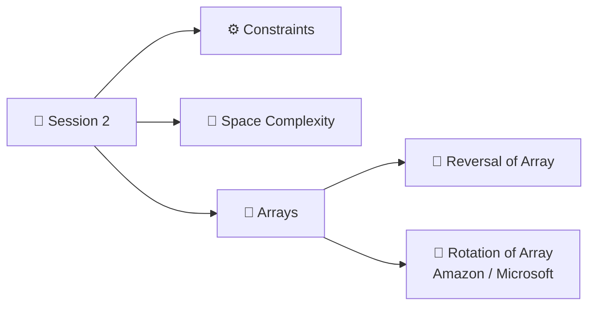

<div align="center">

# 📘 DSA Notes — Learning Journey

**Handwritten class notes → clean, revisable GitHub notes**


</div>

---

## 📑 Table of Contents

1. [⏱️ Time Complexity](#️-time-complexity)
2. [🔍 Power of Observation + Time & Space Complexity](#-power-of-observation--time--space-complexity)
   - [Problem: Count the Factors of a Number](#-problem-count-the-factors-of-a-number)
   - [Approach 1: Brute Force](#-approach-1-brute-force)
   - [Why We Can't Measure "Execution Time"](#-why-we-cant-measure-execution-time)
   - [The 10⁸ Iterations Rule](#-the-10-iterations-rule)
   - [Approach 2: Optimization Using Observation](#-approach-2-optimization-using-observation)
   - [Optimized Code (and the Perfect Square Trap)](#-optimized-code-and-the-perfect-square-trap)
   - [`i * i <= n` vs `i <= sqrt(n)`](#-i--i--n-vs-i--sqrtn)
   - [My Python Code](#-my-python-code)
   - [Quick Revision Summary](#-quick-revision-summary)
3. [📐 Big O: How Can We Compare Algorithms?](#-big-o-how-can-we-compare-algorithms)
   - [The 3 Steps to Find Big O](#-the-3-steps-to-find-big-o)
   - [Worked Examples](#-worked-examples)
   - [Order of Growth (Slowest → Fastest Growing)](#-order-of-growth-slowest--fastest-growing)
   - [Why Can We Ignore Lower Order Terms?](#-why-can-we-ignore-lower-order-terms)
4. [📅 Session 2 Agenda](#-session-2-agenda)
5. [🧠 Math Properties: Logarithms](#-math-properties-logarithms)
6. [⚙️ Importance of Constraints](#️-importance-of-constraints)
7. [💾 Space Complexity](#-space-complexity)
8. [🔢 Using countFactors to Check Prime Numbers](#-using-countfactors-to-check-prime-numbers)
9. [🧮 Arrays and Manipulation](#-arrays-and-manipulation)
10. [📸 Original Notebook Pages](#-original-notebook-pages)

---

## ⏱️ Time Complexity

> [!NOTE]
> Time complexity tells us **how the number of steps (iterations) grows as the input `n` grows**, not how many seconds a program takes.
> The notes below build this idea step by step using one problem: **counting factors**.

---

## 🔍 Power of Observation + Time & Space Complexity

### 🎯 Problem: Count the Factors of a Number

> **Given a number `n`, find the number of factors of `n`.**

A number `i` is a **factor** of `n` if it divides `n` completely:

```
n % i == 0   →   i is a factor of n
```

#### Examples

| `n` | Check every number from 1 to n | Factors | Count |
|:---:|:---|:---|:---:|
| **10** | `10 % 1 = 0` ✅, `10 % 2 = 0` ✅, 3 ❌, 4 ❌, 5 ✅, 6 ❌, 7 ❌, 8 ❌, 9 ❌, 10 ✅ | 1, 2, 5, 10 | **4** |
| **24** | Keep only the ones that divide 24 | 1, 2, 3, 4, 6, 8, 12, 24 | **8** |

---

### 🐢 Approach 1: Brute Force

**Idea:** Try every number from `1` to `n`. If it divides `n`, count it.

#### Pseudocode (as taught in class)

```c
int countFactors(int n) {
    int c = 0;
    for (i = 1; i <= n; i++) {
        if (n % i == 0) {
            c++;
        }
    }
    return c;
}
```

#### Python version

```python
def count_factors(n):
    c = 0
    for i in range(1, n + 1):
        if n % i == 0:
            c += 1
    return c
```

> [!IMPORTANT]
> **Number of iterations = `n`**
> The loop runs once for every number from 1 to n.

---

### 🌋 Why We Can't Measure "Execution Time"

**Execution time?** ➜ We **cannot** give an exact time, because **it depends on the environment and system**.

> [!TIP]
> **Instructor's real-world example 🌋🏔️**
>
> | Where the person (computer) is | Condition | Result |
> |:---|:---|:---|
> | 🌋 On a **volcano** | It is **hot** | **Slow** execution |
> | 🏔️ On **Mount Everest** | It is **cold** | **Fast** execution |
>
> The *same code* can take different time on different machines and conditions.
> So instead of **seconds**, we count **iterations**, which stay the same everywhere.

---

### ⚡ The 10⁸ Iterations Rule

> **Assumption:** $10^8$ iterations are executed in **1 second**.

| `n` | Number of iterations | Execution time |
|:---:|:---:|:---|
| $10^8$ | $10^8$ | **1 sec** |
| $10^9$ | $10^9$ | $\frac{10^9}{10^8}$ = **10 sec** |
| $10^{18}$ | $10^{18}$ | $\frac{10^{18}}{10^8} = 10^{10}$ sec ≈ **317 years** 😱 |

#### How the calculation works

```
10⁸ iterations  →  1 sec
1 iteration     →  1/10⁸ sec
10⁹ iterations  →  10⁹/10⁸  = 10 sec
10¹⁸ iterations →  10¹⁸/10⁸ = 10¹⁰ sec  ≈ 317 years
```

> [!TIP]
> **Instructor's real-world example 👨‍👩‍👧‍👦**
> 317 years is so long that the answer would only reach your **5th generation**!
>
> ```mermaid
> flowchart LR
>     A[👤 You] --> B[👶 Children] --> C[🧒 Grandchildren] --> D[4th generation] --> E[5th generation gets the answer 🎉]
> ```
>
> **Lesson:** For big inputs, the brute force `O(n)` approach is far too slow. We must optimize.

---

### 🔍 Approach 2: Optimization Using Observation

**Key observation:** Factors always come in **pairs**.

$$i \times j = n \quad \text{(i and j are both factors of n)}$$

$$j = \frac{n}{i} \quad \text{(so i and } \tfrac{n}{i} \text{ are both factors of n)}$$

#### Example: `n = 24`

| `i` | `n / i` | |
|:---:|:---:|:---|
| 1 | 24/1 = **24** | ⬅️ **Part 1** |
| 2 | 24/2 = **12** | ⬅️ **Part 1** |
| 3 | 24/3 = **8** | ⬅️ **Part 1** |
| 4 | 24/4 = **6** | ⬅️ **Part 1** |
| 6 | 24/6 = **4** | 🔁 Part 2 (repeat) |
| 8 | 24/8 = **3** | 🔁 Part 2 (repeat) |
| 12 | 24/12 = **2** | 🔁 Part 2 (repeat) |
| 24 | 24/24 = **1** | 🔁 Part 2 (repeat) |

> [!IMPORTANT]
> **Part 1 already has all the answers!** Part 2 is just the same pairs flipped.
>
> Part 1 is where `i <= n/i`, so:
>
> $$i \le \frac{n}{i} \;\Rightarrow\; i^2 \le n \;\Rightarrow\; i \le \sqrt{n}$$
>
> 👉 We only need to loop **up to √n**, and count **2 factors** (`i` and `n/i`) each time.

---

### 🚀 Optimized Code (and the Perfect Square Trap)

Loop condition: `i <= sqrt(n)` **or** `i * i <= n`

#### ❌ First attempt (wrong)

```c
int countFactorsOptimised(int n) {
    count = 0;
    for (i = 1; i * i <= n; i++) {
        if (n % i == 0) {
            count += 2;
        }
    }
    return count;
}
```

> [!WARNING]
> **This is wrong for perfect squares!**
> For `n = 100`, when `i = 10` we get `n / i = 10`, which is the **same number**.
> Adding 2 counts `10` **twice**.

#### Example: `n = 100`

| `i` | `n / i` | |
|:---:|:---:|:---|
| 1 | 100/1 = 100 | |
| 2 | 100/2 = 50 | |
| 5 | 100/5 = 20 | |
| **10** | **100/10 = 10** | ⭕ **`i == n/i` → count only once!** |
| 20 | 100/20 = 5 | |
| 50 | 100/50 = 2 | |
| 100 | 100/100 = 1 | |

> [!NOTE]
> *Added while making these notes:* the full factor list of 100 also includes **4** and **25** (`100/4 = 25`).
> Complete list: 1, 2, 4, 5, 10, 20, 25, 50, 100 → **9 factors**.

#### ✅ Correct optimized code

```c
int countFactorsOptimised(int n) {
    count = 0;
    for (i = 1; i * i <= n; i++) {
        if (n % i == 0) {
            if (i == n / i) {
                count += 1;     // perfect square: i and n/i are the same
            } else {
                count += 2;     // i and n/i are two different factors
            }
        }
    }
    return count;
}
```

**Iterations:** only **√n**, so the time complexity is **O(√n)**.

---

### ⚖️ `i * i <= n` vs `i <= sqrt(n)`

| Loop condition | What happens | Complexity | Verdict |
|:---|:---|:---:|:---|
| `i * i <= n` | `2×2`, `3×3` are simple multiplications (constant work), no extra calculation needed | O(√n) | ⚡ **Fast** |
| `i <= sqrt(n)` inside the loop | `sqrt(n)` is recalculated **at every iteration** (≈ `log n` work each time) | O(√n) | 🐌 More expensive |
| `limit = sqrt(n)` computed **once**, then `i <= limit` | Square root is calculated only one time | O(√n) | 👍 Very good |

> [!TIP]
> In terms of speed, **`i * i <= n` is the faster choice.**

---

### 🐍 My Python Code

This is the version I wrote in the Python compiler, **with one fix**:

```python
n = 100
i = 1
count = 0
while i * i <= n:
    if n % i == 0:
        if i == n // i:      # ✅ fixed: was  i == n % i
            count += 1
        else:
            count += 2
    i += 1
print(count)   # 9
```

> [!CAUTION]
> **Bug I made:** I originally wrote `if (i == n % i)`.
> Inside this block `n % i` is always `0` (we already checked `n % i == 0`), so the condition is never true and every pair adds 2.
> For `n = 100` that printed **10** instead of **9**.
> ✔️ Use `n // i` (integer division), **not** `n % i` (remainder).

---

### 📝 Quick Revision Summary

| | Brute Force | Optimized |
|:---|:---:|:---:|
| **Loop runs** | `1 → n` | `1 → √n` |
| **Iterations** | `n` | `√n` |
| **Time Complexity** | **O(n)** | **O(√n)** |
| **Space Complexity** | O(1) | O(1) |
| **n = 10¹⁸** (at 10⁸ iterations/sec) | ≈ 317 years 😱 | √10¹⁸ = 10⁹ iterations ≈ **10 sec** ⚡ |

**🧠 Remember:**
- Count **iterations**, not seconds (🌋 volcano vs 🏔️ Everest).
- **10⁸ iterations ≈ 1 second.**
- Factors come in **pairs** `(i, n/i)`, so we only loop till **√n**.
- Watch out for **perfect squares**: when `i == n/i`, count **once**.
- Prefer `i * i <= n` over calling `sqrt(n)` every iteration.

---

## 📐 Big O: How Can We Compare Algorithms?

**Idea 1** was counting iterations (from the factors problem).
**Idea 2 ➜ Big O Complexity** 🏆

Big O gives us:
1. A common **comparison criteria** for algorithms
2. The **worst case** of an algorithm

### 🪜 The 3 Steps to Find Big O

| Step | What to do |
|:---:|:---|
| **1️⃣** | **Calculate** the number of iterations |
| **2️⃣** | **Ignore lower order terms** |
| **3️⃣** | **Ignore constant coefficients** |

### ✏️ Worked Examples

#### Example 1: Iterations = `100 log₂n`

| Step | Result |
|:---|:---|
| 1️⃣ Number of iterations | `100 log₂n` |
| 2️⃣ Ignore lower order terms | Nothing to ignore (only one term) |
| 3️⃣ Ignore constant coefficient | ~~100~~ `log₂n` |
| ✅ **Big O** | **O(log n)** |

#### Example 2: Iterations = `4n + 3n² + 60 log₂n`

| Step | Result |
|:---|:---|
| 1️⃣ Number of iterations | `4n + 3n² + 60 log₂n` |
| 2️⃣ Ignore lower order terms | Among `n`, `n²`, `log₂n`, the highest is **n²**, so cancel `4n` and `60 log₂n` |
| 3️⃣ Ignore constant coefficient | ~~3~~`n²` |
| ✅ **Big O** | **O(n²)** |

#### Example 3: Iterations = `4n + 3n log n + 1`

`n × log n` is the higher term ➜ **Big O = O(n log n)**

#### Example 4: Iterations = `4n log n + 3n√n + 10⁶`

**Big O = O(n√n)**

Why is `n√n` bigger than `n log n`? Try **n = 100**:

```
√100    = 10
log₂100 = 6.6...
```

So `√n > log n`, which means `n√n > n log n`. And `10⁶` is just a constant.

#### 📝 Quiz: Iterations = `4n² + 3n + 1`

<details>
<summary><b>Click for answer</b></summary>

**Big O = O(n²)**

</details>

### 📈 Order of Growth (Slowest → Fastest Growing)

```
log₂n  <  √n  <  n  <  n log n  <  n√n  <  n²  <  n³  <  ...  <  2ⁿ  <  n!  <  nⁿ
```

> [!TIP]
> *Added for revision:* rough values at **n = 100** to feel the difference
>
> | log₂n | √n | n | n log n | n√n | n² | n³ | 2ⁿ | n! |
> |:---:|:---:|:---:|:---:|:---:|:---:|:---:|:---:|:---:|
> | ≈ 6.6 | 10 | 100 | ≈ 664 | 1,000 | 10⁴ | 10⁶ | ≈ 10³⁰ | ≈ 10¹⁵⁸ |

### 🤔 Why Can We Ignore Lower Order Terms?

*Is it OK to blindly ignore them?* Let's check with an example.

**Iterations = `n² + 10n`** ➜ **Big O = O(n²)**
- Higher order term = `n²`
- Lower order term = `10 × n`

| Input size | Iterations `[n² + 10n]` | % of lower term contribution in total iterations |
|:---:|:---|:---|
| **n = 10** | 10² + 10×10 = **200** | L.O. = 10×10 = 100 → 100/200 × 100% = **50%** |
| **n = 100** | 100² + 10×100 = 10000 + 1000 = **11,000** | L.O. = 10×100 = 1000 → 1000/11000 × 100% = **≈ 9%** |
| **n = 10⁴** | (10⁴)² + 10×10⁴ = **10⁸ + 10⁵** | L.O. = 10×10⁴ = 10⁵ → 10⁵/(10⁸ + 10⁵) × 100% = **≈ 0.1%** |

> [!IMPORTANT]
> **Conclusion:** As input size increases, the **contribution of the lower order term decreases significantly**.
> That's why Big O keeps only the highest term.

---

## 📅 Session 2 Agenda



---

## 🧠 Math Properties: Logarithms

> [!NOTE]
> **Log properties to remember**
>
> $$\log(a^b) = b \cdot \log a$$
>
> $$\frac{\log a}{\log b} = \log_b a$$

### ❓ Q: If `2ᵏ = n`, then what is `k`?

Apply **log on both sides**:

$$2^k = n$$

$$\log(2^k) = \log n$$

$$k \cdot \log 2 = \log n \quad \text{(power rule)}$$

$$k = \frac{\log n}{\log 2}$$

$$\boxed{k = \log_2 n} \quad \text{(change of base rule)}$$

> [!TIP]
> **Meaning:** `log₂n` = *how many times you can double 1 (or halve n) to reach n (or 1)*.
> This is why algorithms that **halve the input every step** are **O(log n)**.

---

## ⚙️ Importance of Constraints

Every problem statement has:

| Part | Example |
|:---|:---|
| 📄 **Problem** | What to solve |
| ⚙️ **Constraints** | `1 <= n <= 10⁵` |
| 📥 **Inputs** | What we are given |
| 💡 **Examples** | Sample input / output |

- **Time taken to execute** also depends on the **programming language**.

> [!WARNING]
> **We mostly ignore constraints**, but they tell us **which time complexity is allowed!**

> [!IMPORTANT]
> **A common machine can execute about 10⁸ iterations max in 1 second.**

### 🎬 Scenario 1: `1 <= n <= 10⁵`

Will each solution fit into **10⁸ iterations**?

| Person | Approach | Iterations for n = 10⁵ | Result |
|:---:|:---:|:---|:---:|
| 👤 **Person 1** | **O(n)** | 10⁵ | ✅ **Yes, it will work** |
| 👤 **Person 2** | **O(n²)** | (10⁵)² = **10¹⁰ > 10⁸** | ❌ **Will not work → TLE** |
| 👤 **Person 3** | **O(n log n)** | 10⁵ × log(10⁵) ≈ 10⁵ × 17 ≈ 1.7 × 10⁶ **< 10⁸** | ✅ **It will work** |

> **TLE** = *Time Limit Exceeded*

> [!TIP]
> *Added for revision:* a quick cheat sheet from the 10⁸ rule
>
> | If `n` is up to... | Safe complexity |
> |:---:|:---|
> | 10 | O(n!) |
> | 20 | O(2ⁿ) |
> | 500 | O(n³) |
> | 10⁴ | O(n²) |
> | 10⁵ – 10⁶ | O(n log n) / O(n) |
> | 10⁹ and above | O(√n) / O(log n) / O(1) |

---

## 💾 Space Complexity

> **Space Complexity** = **Extra space** needed by an **algorithm** to solve a problem.
> (The input array of size `n` is given to us.)

### 📦 Case 1: Creating a temp array ➜ O(n)

```c
int[] doSomething(int[] A) {   // A has n elements
    ...
    int tmp[n];                // new temp array
    ...
    return tmp;                // function returns an array
}
```

The new temp array in memory:

```
┌───┬───┬───┬───┬───┬───┬───┐
│ 4 │ 4 │ 4 │ 4 │ 4 │ 4 │ 4 │   ← each box = 1 integer = 4 bytes
└───┴───┴───┴───┴───┴───┴───┘
            n boxes
```

- Size of array = `n`
- Every integer = **4 bytes**
- Total space taken = **4 × n**
- Ignore the coefficient for Big O ➜ **O(n)**

### 📦 Case 2: Returning the same array ➜ O(1)

```c
int[] doSomething(int[] A) {
    ...
    return A;                  // no new array created
}
```

**Space Complexity = O(1)**

### 🎤 Interview Situation

> [!TIP]
> **Instructor's real-world example 🎤**
>
> **Interviewer:** *"Do you think the temp array solution is O(1) space complexity?"*
>
> **You (with justification):** *"You are asking me to return an int array, so you are **forcing me to create that array**."*
> The output array is required by the problem itself, so you can reason about whether it counts as *extra* space.

> [!IMPORTANT]
> **Outcome:** When the interviewer tries to confuse you, **don't blindly agree**.
> Think about the **logic** behind it, and give a **logical and proper reason**.

---

## 🔢 Using countFactors to Check Prime Numbers

> [!NOTE]
> *Added to connect the countFactors code with prime numbers.*

A **prime number** has **exactly 2 factors**: `1` and **itself**.

| n | Factors | Count | Prime? |
|:---:|:---|:---:|:---:|
| 1 | 1 | 1 | ❌ |
| 7 | 1, 7 | 2 | ✅ |
| 10 | 1, 2, 5, 10 | 4 | ❌ |
| 13 | 1, 13 | 2 | ✅ |

So we can **reuse** our optimized `countFactors`:

```python
def count_factors(n):
    count = 0
    i = 1
    while i * i <= n:
        if n % i == 0:
            if i == n // i:
                count += 1
            else:
                count += 2
        i += 1
    return count


def is_prime(n):
    return count_factors(n) == 2


print(is_prime(13))   # True
print(is_prime(24))   # False
print([n for n in range(1, 40) if is_prime(n)])
# [2, 3, 5, 7, 11, 13, 17, 19, 23, 29, 31, 37]
```

| | Time Complexity | Space Complexity |
|:---|:---:|:---:|
| `is_prime` using optimized `count_factors` | **O(√n)** | **O(1)** |

---

## 🧮 Arrays and Manipulation

Coming up in Session 2:
- 🔄 **Reversal of Array**
- 🔁 **Rotation of Array** *(asked in Amazon / Microsoft)*

> [!NOTE]
> 🚧 *Notes coming soon — will be added after the next class.*

---

## 📸 Original Notebook Pages

<details>
<summary><b>Click to view my handwritten notes</b></summary>

<br>

**Page 1: Problem, brute force, execution time**


**Page 2: 10⁸ rule and optimization approach**


**Page 3: Optimized code and perfect squares**


**Page 4: Big O, the 3 steps, examples 1 & 2**


**Page 5: Examples 3 & 4, order of growth, lower order terms table**


**Page 6: Conclusion, Session 2 agenda, logarithms**


**Page 7: Quiz and importance of constraints**


**Page 8: Space complexity**


</details>

---

<div align="center">

⭐ *Made with consistency, one class at a time.* ⭐

</div>
