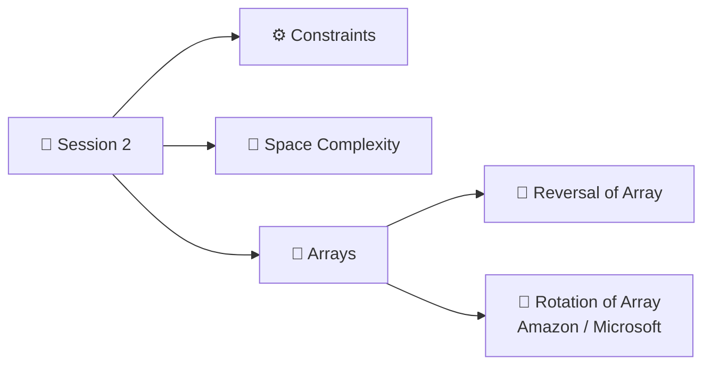

<p align="center"><a href="Session-1.md">⬅️ Session 1</a> &nbsp;|&nbsp; 🏠 <a href="README.md">Home</a></p>

<div align="center">

# 📙 Session 2: Constraints, Space Complexity & Arra

</div>

<div align="center">


</div>

---

## 📑 Table of Contents

1. [📅 Agenda](#-agenda)
2. [📝 Recap Quiz](#-recap-quiz)
3. [🧠 Math Properties: Logarithms](#-math-properties-logarithms)
4. [⚙️ Importance of Constraints](#️-importance-of-constraints)
5. [💾 Space Complexity](#-space-complexity)
6. [🧮 Arrays and Manipulation](#-arrays-and-manipulation)
7. [📸 Session 2: Notebook Pages](#-session-2-notebook-pages)

---

## 📅 Agenda



---

## 📝 Recap Quiz

Iterations = `4n² + 3n + 1`

<details>
<summary><b>Click for answer</b></summary>

**Big O = O(n²)**

</details>

---

## 🧠 Math Properties: Logarithms

> [!NOTE]
> **Log properties to remember**
>
> $$\log(a^b) = b \cdot \log a$$
>
> $$\frac{\log a}{\log b} = \log_b a$$

### ❓ Q: If `2ᵏ = n`, then what is `k`?

Apply **log on both sides**:

$$2^k = n$$

$$\log(2^k) = \log n$$

$$k \cdot \log 2 = \log n \quad \text{(power rule)}$$

$$k = \frac{\log n}{\log 2}$$

$$\boxed{k = \log_2 n} \quad \text{(change of base rule)}$$

> [!TIP]
> **Meaning:** `log₂n` = *how many times you can double 1 (or halve n) to reach n (or 1)*.
> This is why algorithms that **halve the input every step** are **O(log n)**.

---

## ⚙️ Importance of Constraints

Every problem statement has:

| Part | Example |
|:---|:---|
| 📄 **Problem** | What to solve |
| ⚙️ **Constraints** | `1 <= n <= 10⁵` |
| 📥 **Inputs** | What we are given |
| 💡 **Examples** | Sample input / output |

- **Time taken to execute** also depends on the **programming language**.

> [!WARNING]
> **We mostly ignore constraints**, but they tell us **which time complexity is allowed!**

> [!IMPORTANT]
> **A common machine can execute about 10⁸ iterations max in 1 second.**

### 🎬 Scenario 1: `1 <= n <= 10⁵`

Will each solution fit into **10⁸ iterations**?

| Person | Approach | Iterations for n = 10⁵ | Result |
|:---:|:---:|:---|:---:|
| 👤 **Person 1** | **O(n)** | 10⁵ | ✅ **Yes, it will work** |
| 👤 **Person 2** | **O(n²)** | (10⁵)² = **10¹⁰ > 10⁸** | ❌ **Will not work → TLE** |
| 👤 **Person 3** | **O(n log n)** | 10⁵ × log(10⁵) ≈ 10⁵ × 17 ≈ 1.7 × 10⁶ **< 10⁸** | ✅ **It will work** |

> **TLE** = *Time Limit Exceeded*

> [!TIP]
> *Added for revision:* a quick cheat sheet from the 10⁸ rule
>
> | If `n` is up to... | Safe complexity |
> |:---:|:---|
> | 10 | O(n!) |
> | 20 | O(2ⁿ) |
> | 500 | O(n³) |
> | 10⁴ | O(n²) |
> | 10⁵ – 10⁶ | O(n log n) / O(n) |
> | 10⁹ and above | O(√n) / O(log n) / O(1) |

---

## 💾 Space Complexity

> **Space Complexity** = **Extra space** needed by an **algorithm** to solve a problem.
> (The input array of size `n` is given to us.)

### 📦 Case 1: Creating a temp array ➜ O(n)

```c
int[] doSomething(int[] A) {   // A has n elements
    ...
    int tmp[n];                // new temp array
    ...
    return tmp;                // function returns an array
}
```

The new temp array in memory:

```
┌───┬───┬───┬───┬───┬───┬───┐
│ 4 │ 4 │ 4 │ 4 │ 4 │ 4 │ 4 │   ← each box = 1 integer = 4 bytes
└───┴───┴───┴───┴───┴───┴───┘
            n boxes
```

- Size of array = `n`
- Every integer = **4 bytes**
- Total space taken = **4 × n**
- Ignore the coefficient for Big O ➜ **O(n)**

### 📦 Case 2: Returning the same array ➜ O(1)

```c
int[] doSomething(int[] A) {
    ...
    return A;                  // no new array created
}
```

**Space Complexity = O(1)**

### 🎤 Interview Situation

> [!TIP]
> **Instructor's real-world example 🎤**
>
> **Interviewer:** *"Do you think the temp array solution is O(1) space complexity?"*
>
> **You (with justification):** *"You are asking me to return an int array, so you are **forcing me to create that array**."*
> The output array is required by the problem itself, so you can reason about whether it counts as *extra* space.

> [!IMPORTANT]
> **Outcome:** When the interviewer tries to confuse you, **don't blindly agree**.
> Think about the **logic** behind it, and give a **logical and proper reason**.

---

## 🧮 Arrays and Manipulation

Coming up in Session 2:
- 🔄 **Reversal of Array**
- 🔁 **Rotation of Array** *(asked in Amazon / Microsoft)*

> [!NOTE]
> 🚧 *Notes coming soon — will be added after the next class.*

---

## 📸 Session 2: Notebook Pages

<details>
<summary><b>Click to view my handwritten notes</b></summary>

<br>

**Page 6: Conclusion (end of Session 1), Session 2 agenda, logarithms**


**Page 7: Quiz and importance of constraints**


**Page 8: Space complexity**


</details>

---

<p align="center"><a href="Session-1.md">⬅️ Session 1</a> &nbsp;|&nbsp; 🏠 <a href="README.md">Home</a></p>

---

<div align="center">

⭐ *Made with consistency, one class at a time.* ⭐

</div>
